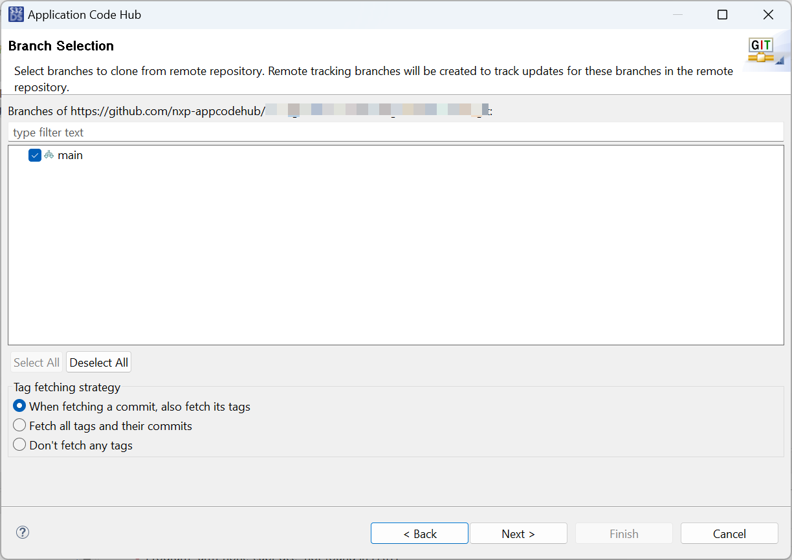
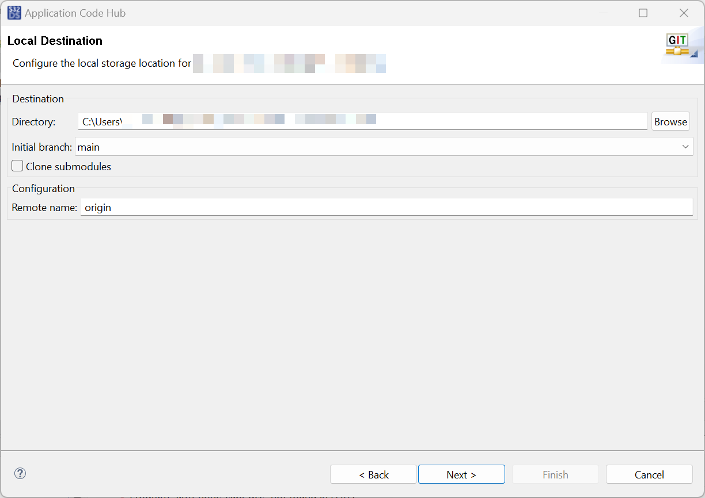
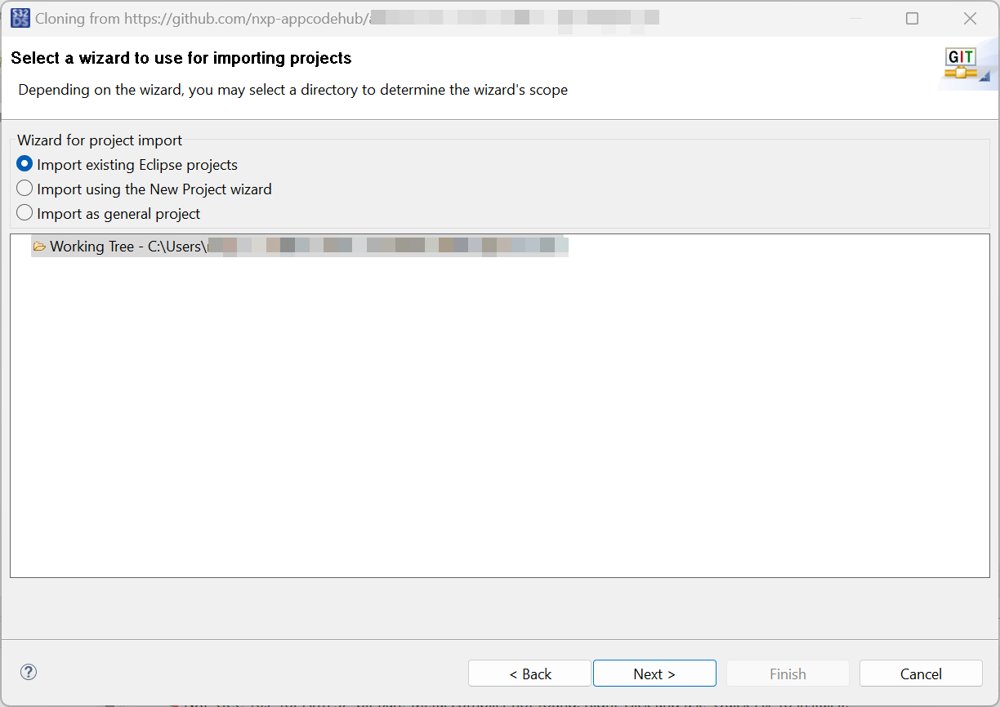
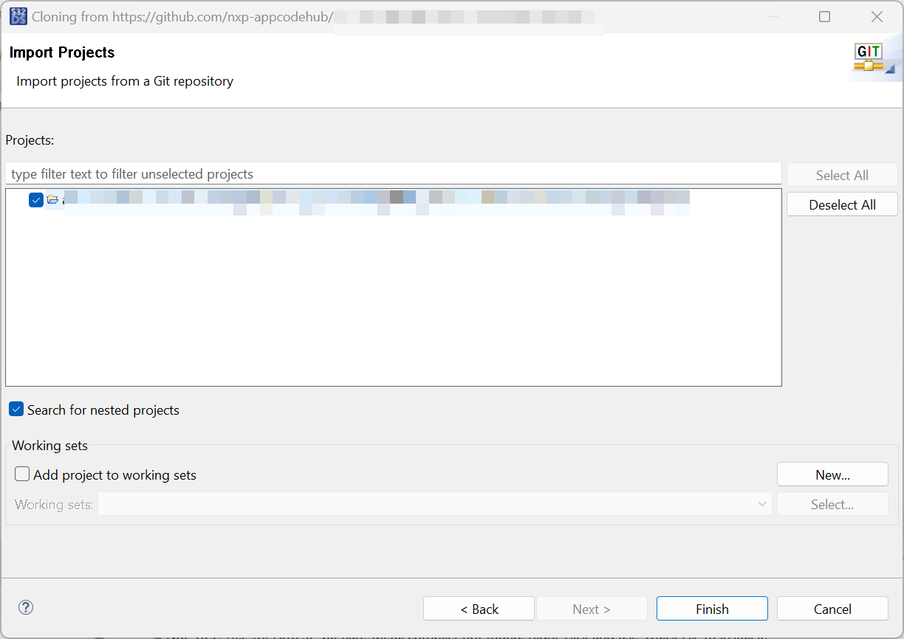
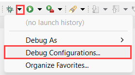

# NXP Application Code Hub
[](https://www.nxp.com)

## Ethernet Communication using FRDM-A-S32K344
This project implements a configurable Ethernet communication node that can operate in two different modes—Transmit (TX) and Receive (RX)—selected at build time using compile‑time macros. Depending on which macro is enabled during compilation, the firmware conditionally includes only the logic required for that mode.
```c
/* Macro for NODE selection: Select ETH_TX or ETH_RX and flash its corresponding profile */
#define ETH_TX				(1U)    /* ETH_TX is selected */
#define ETH_RX				(0U)
```

TX Node Mode (ETH_TX) - In this mode, the device periodically transmits Ethernet frames containing the ADC reading of the potentiometer on board.

RX Node Mode (ETH_RX) -
The device listens for incoming Ethernet frames and processes the data to activate an LED depending on the ADC value received.

#### Boards: FRDM-A-S32K344
#### Categories: Communication
#### Peripherals: Siul2, ADC, ETH 43 GMAC
#### Toolchains: S32 Design Studio IDE

## Table of Contents
1. [Software and Tools](#step1)
2. [Hardware](#step2)
3. [Setup](#step3)
4. [Results](#step4)
5. [Support](#step6)
6. [Release Notes](#step7)

## 1. Software and Tools<a name="step1"></a>
This example was developed using the FRDM Automotive Bundle for S32K3. To download and install the complete software and tools ecosystem, use the following link: [S32K3 FRDM Automotive Board Installation Package](https://www.nxp.com/app-autopackagemgr/automotive-software-package-manager:AUTO-SW-PACKAGE-MANAGER?currentTab=0&selectedDevices=S32K3&applicationVersionID=156)

## 2. Hardware<a name="step2"></a>
### 2.1 Required Hardware
- Personal Computer
- Type-C USB cable
- Ethernet cable
- 2 * [FRDM-A-S32K344](https://www.nxp.com/design/design-center/development-boards-and-designs/S32K344MINI-EVB)[<p align="center"></p>](https://www.nxp.com/assets/images/en/dev-board-image/S32K344-EVB-TOP.png)


### 2.3 Debugger Connection
- Connect the PEmicro debugger to the Cortex Debug connector
- Connect debugger USB to PC
- Power the FRDM-A-S32K344 using the USB-C cable or connect USB C cable directly to the board for power supply and debug capabi​lities

## 3. Setup<a name="step3"></a>

### 3.1 Import the Project into S32 Design Studio IDE
1. Open S32 Design Studio IDE, in the Dashboard Panel, choose **Import project from Application Code Hub**.
[<p align="center"></p>](./images/import_project_1.png)

2. Found demo you need by searching the name directly. Open the project, click the **GitHub link**, S32 Design Studio IDE will automatically retrieve project attributes then click **Next>**.
[<p align="center"></p>](./images/import_project_2.png) 
[<p align="center"></p>](./images/import_project_3.png)

3. Select **main** branch and then click **Next>**.
[<p align="center"></p>](./images/import_project_4.png)

4. Select your local path for the repo in **Destination->Directory:** window. The S32 Design Studio IDE will clone the repo into this path, click **Next>**.
[<p align="center"></p>](./images/import_project_5.png)

5. Select **Import existing Eclipse projects** then click **Next>**.
[<p align="center"></p>](./images/import_project_6.png)

6. Select the project in this repo (only one project in this repo) then click **Finish**.
[<p align="center"></p>](./images/import_project_7.png)

### 3.2 Generating, Building and Running the Example
1. In Project Explorer, right-click the project and select **Update Code and Build Project**. This will generate the configuration (Pins, Clocks, Peripherals), update the source code and build the project using the active configuration (e.g. Debug_FLASH). Make sure the build completes successfully and the *.elf file is generated without errors.
[<p align="center"></p>](./images/UpdateCodeAndBuildProject.png)
Press **Yes** in the **SDK Component Management** pop-up window to continue.

> Note: Save .elf file in a safe location (clean project will remove Debug_FLASH folder) as it will be needed for flashing the second board with the alternative node mode (ETH_RX or ETH_TX).

2. To generate the 2nd executable, the macro must be modified to use the other node mode. In the main.h file, change the macro definition from `#define ETH_TX (1U)` to `#define ETH_TX (0U)` and `#define ETH_RX (0U)` to `#define ETH_RX (1U)`. 

3. In Project Explorer, find 
    ```txt
    ${ProjectLoc}/RTD/src/EthIf.c
    ```
    and add `#include "Eth_43_GMAC.h"` and `volatile uint16 AdcReceiveResult = 0U;` at the top of the file to enable Ethernet driver functionality. Locate `EthIf_RxIndication` function and add the following code to process received frames at the end of the function:
    ```c
    if (DataLen >= 3U) {
        AdcReceiveResult = ((uint16) DataPtr[1] << 8U) | (uint16) DataPtr[2];
    }
    Eth_43_GMAC_ReleaseRxBuffer(CtrlIdx, RxHandleId);
    ```

4. Then clean project and build again to generate the RX node executable.

5. Go to **Debug** and select **Debug Configurations**. Select **GDB PEMicro Interface Debugging**:
[<p align="center"></p>](./images/DebugConfigurations.png)

Use the controls to control the program flow.

> Note: The GDB PEMicro Interface Debugging configuration uses a default ports 6224 and 7224. In example are provided 2 debug configurations, one with default ports and another one with custom ports to support debugging of 2 boards simultaneously on the same PC. You must change the `C/C++ Application` path in the debug configuration to point to the generated *.elf file, one for TX node and one for RX node. In one launch configuration, select one board (for example USB1) and in the second launch configuration, select the other board (for example USB2).

## 4. Results<a name="step4"></a>
When one board is connected as receiver and another one is connected as transmitter, using one ETH cable directly in boards, the RGB LED on the transmitter board will light up depending on the value of the ADC, on the receiver board, the RGB LED will light up when the message was successfully received with the color according to the ADC received value.

[<p align="center"></p>](./images/result.gif)

## 5. Support<a name="step6"></a>
For general technical questions related to NXP microcontrollers, please use the *[NXP Community Forum](https://community.nxp.com/)*.
#### Project Metadata

<!----- Boards ----->
[]()

<!----- Peripherals ----->
[]()
[]()
[]()

<!----- Toolchains ----->
[](https://mcuxpresso.nxp.com/appcodehub?toolchain=s32_design_studio_ide)

Questions regarding the content/correctness of this example can be entered as Issues within this GitHub repository.

>**Warning**: For more general technical questions regarding NXP Microcontrollers and the difference in expected functionality, enter your questions on the [NXP Community Forum](https://community.nxp.com/)

[](https://www.youtube.com/NXP_Semiconductors)
[](https://www.linkedin.com/company/nxp-semiconductors)
[](https://www.facebook.com/nxpsemi/)
[](https://x.com/NXP)

## 6. Release Notes<a name="step7"></a>
| Version | Description / Update                           | Date                        |
|:-------:|------------------------------------------------|----------------------------:|
| 1.0     | Initial release on Application Code Hub        |February 16<sup>th</sup> 2026|